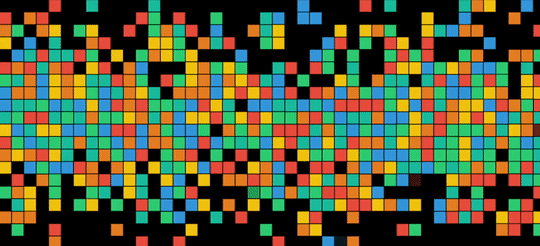

# Pixel-Banner



This is a Javascript plugin that displays an animated background in a selected dom element using HTML5 canvas.

Background consists of multuple "pixel" blocks that span the selected element, and animate by fading out, then fading in at another random location with a different color. The occurrence of these blocks are affected by probability to be more dense towards the center and more sparse at the edges.

Built because i was inspired by the design of a colleague of mine.


(i later found out that he never intended them to be animated, so that was a happy accident)

---

## Use

Simply import the plugin, then call `new PixelBanner({target: "#selector"});`

### default config
```
PixelBanner.defaults = {
		target: "body",
		dynamic_options: {
			dynamic: true,
			update_mode: "single",
			update_interval: 250,
			fade_interval_duration: 50
		},
		pixel_options: {
			size: {width: 40, height: 40},
			color_pallete: ["#1abc9c", "#2ecc71", "#3498db", "#f1c40f", "#e67e22", "#e74c3c"],
			probability: {x_axis: "always", y_axis: "always"},
			border: {width: 1, color: "#000"}
		}
    }
```